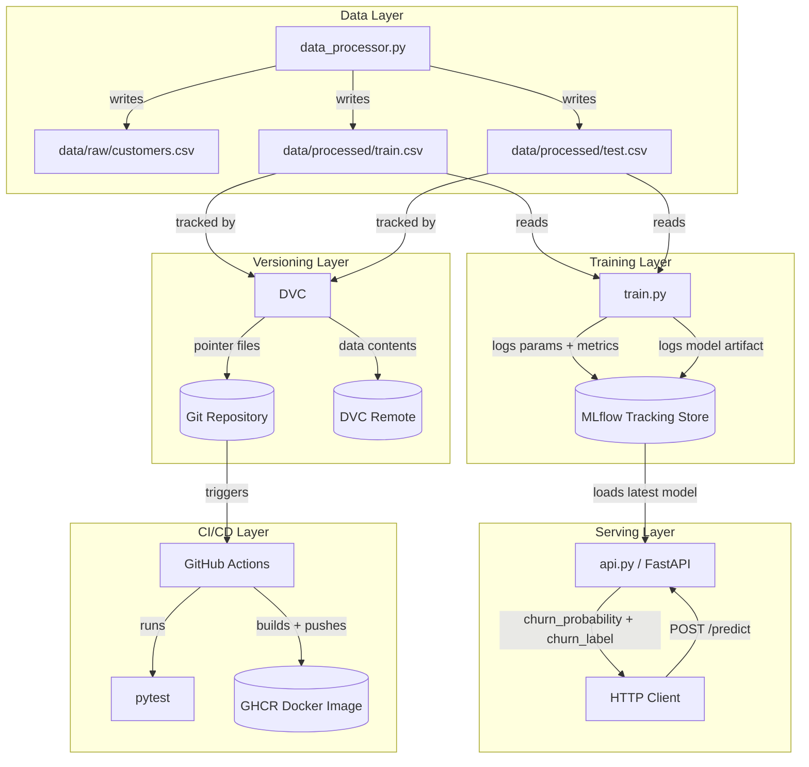
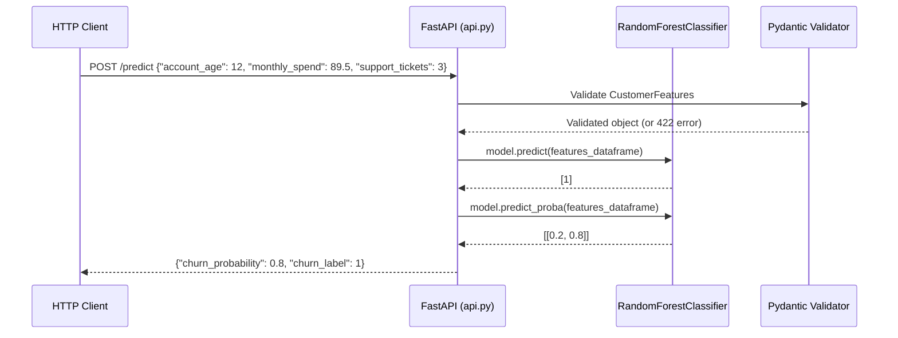
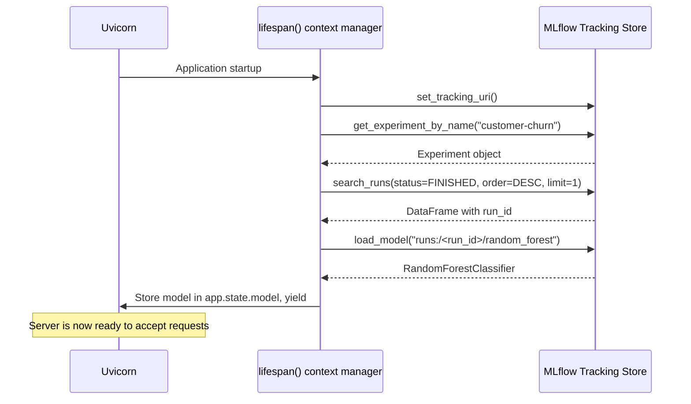
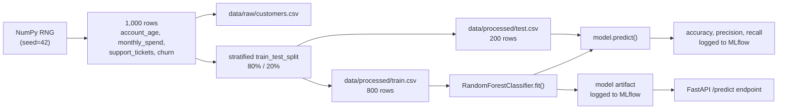

# 02 — System Architecture

## Overview

The customer-churn system is composed of five distinct layers that work together to take raw data all the way to a live prediction API. Each layer has a single responsibility and communicates with the others through well-defined interfaces (files, HTTP, or the MLflow tracking API).

## Component Descriptions

### Data Layer — `data_processor.py`

The entry point for the entire pipeline. It generates a synthetic dataset, saves the raw CSV, and splits it into training and test sets. Nothing downstream can run without this step completing first.

**Inputs:** None (generates data programmatically)  
**Outputs:** `data/raw/customers.csv`, `data/processed/train.csv`, `data/processed/test.csv`

### Training Layer — `train.py`

Reads the processed training and test CSVs, trains a Random Forest classifier, evaluates it on the test set, and logs everything to MLflow. The trained model is stored as an MLflow artifact — not as a local file — making it accessible to any component that can reach the MLflow tracking store.

**Inputs:** `data/processed/train.csv`, `data/processed/test.csv`, `configs/config.yaml`  
**Outputs:** MLflow run (parameters, metrics, model artifact)

### Serving Layer — `api.py`

A FastAPI application that loads the latest completed MLflow run's model at startup and exposes a `/predict` endpoint. The model lives in `app.state.model` for the lifetime of the server process.

**Inputs:** MLflow tracking store (at startup), HTTP POST requests (at runtime)  
**Outputs:** JSON responses with `churn_probability` and `churn_label`

### Versioning Layer — DVC + `setup_data_tracking.sh`

DVC (Data Version Control) tracks the processed data directory. Instead of committing large CSV files to Git, DVC commits small pointer files (`.dvc` files) that record the data's hash and location. The actual data is stored in DVC's cache or a configured remote.

**Inputs:** `data/processed/` directory  
**Outputs:** `data/processed.dvc` pointer file, `.dvc/` metadata directory

### CI/CD Layer — `.github/workflows/ci.yml`

A GitHub Actions workflow with two jobs. The `test` job runs on every push and pull request to `main`. The `build-and-push` job runs only on pushes to `main` (after tests pass) and publishes the Docker image to GitHub Container Registry (GHCR).

**Inputs:** Git push or pull request event  
**Outputs:** Test results; Docker image at `ghcr.io/<owner>/customer-churn-api:latest`

---

## Request/Response Flow

This diagram traces a single prediction request from the HTTP client to the response.

## API Startup Flow

Before the API can serve requests, it must load the model. This happens once when the server starts.

## Data Flow Through the Pipeline

---

Previous: [Project Overview ←](01-project-overview.md) | Next: [Project Structure →](03-project-structure.md)
