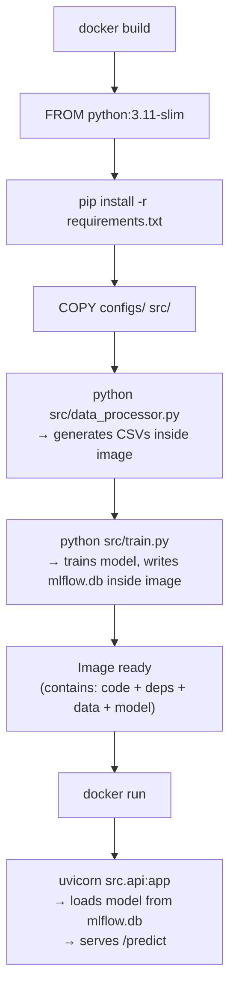

# 13 — Docker and Containerisation

**Source file:** [`customer-churn/Dockerfile`](../customer-churn/Dockerfile)

## What Is Docker?

**Docker** is a platform for building and running **containers**. A container is a lightweight, isolated environment that packages an application together with all its dependencies — Python, libraries, configuration — into a single portable unit.

The key benefit: a Docker container runs identically on a developer's laptop, in CI, and in production. "It works on my machine" stops being a problem.

## The Dockerfile

```dockerfile
FROM python:3.11-slim

ENV PYTHONDONTWRITEBYTECODE=1 \
    PYTHONUNBUFFERED=1

WORKDIR /app

COPY requirements.txt .
RUN pip install --no-cache-dir -r requirements.txt

COPY configs/ configs/
COPY src/ src/
RUN python src/data_processor.py && python src/train.py

EXPOSE 8000

CMD ["uvicorn", "src.api:app", "--host", "0.0.0.0", "--port", "8000"]
```

### Line-by-Line Explanation

**`FROM python:3.11-slim`**

The base image. `python:3.11-slim` is an official Python image based on Debian with only the minimal packages needed to run Python. The `-slim` variant is significantly smaller than the full `python:3.11` image.

**`ENV PYTHONDONTWRITEBYTECODE=1 PYTHONUNBUFFERED=1`**

Two Python environment variables:
- `PYTHONDONTWRITEBYTECODE=1` — prevents Python from writing `.pyc` bytecode files to disk (not needed in a container).
- `PYTHONUNBUFFERED=1` — forces Python's stdout and stderr to be unbuffered, so log output appears immediately in `docker logs` rather than being held in a buffer.

**`WORKDIR /app`**

Sets the working directory inside the container. All subsequent `COPY`, `RUN`, and `CMD` instructions operate relative to `/app`.

**`COPY requirements.txt .` then `RUN pip install ...`**

Copies only `requirements.txt` first, then installs dependencies. This is a Docker layer caching optimisation: if `requirements.txt` has not changed, Docker reuses the cached layer and skips the slow `pip install` step on subsequent builds.

**`COPY configs/ configs/` and `COPY src/ src/`**

Copies the configuration and source code into the image. The `data/` and `models/` directories are excluded by `.dockerignore`.

**`RUN python src/data_processor.py && python src/train.py`**

This is the most important and unusual part of the Dockerfile. During the **build**, the image generates synthetic data and trains a model. The trained model is stored in the MLflow local SQLite database (`mlflow.db`) inside the image.

This means the Docker image ships with a **pre-trained model baked in**. When the container starts, `api.py` loads the model from the local SQLite store without needing any external MLflow connection.

> **Trade-off:** The image is self-contained and easy to deploy, but the model is fixed at build time. To update the model, you must rebuild the image.

**`EXPOSE 8000`**

Documents that the container listens on port 8000. This does not actually publish the port — that is done with `-p 8000:8000` in `docker run`.

**`CMD ["uvicorn", "src.api:app", "--host", "0.0.0.0", "--port", "8000"]`**

The default command to run when the container starts. `--host 0.0.0.0` makes the server listen on all network interfaces inside the container, which is required for the port mapping to work.

## `.dockerignore`

```
data/
models/
.git
__pycache__/
.pytest_cache/
mlruns/
mlflow.db*
.env
```

These files are excluded from the **build context** — the set of files sent to the Docker daemon when building. Excluding `data/` and `models/` prevents large generated files from being sent unnecessarily (the Dockerfile regenerates them during the build anyway). Excluding `.env` prevents secrets from being baked into the image.

## Building and Running

```bash
# Build the image (from the customer-churn/ directory)
docker build -t customer-churn-api .

# Run the container
docker run --rm --env-file .env -p 8000:8000 customer-churn-api
```

**`--rm`** — Automatically removes the container when it stops.  
**`--env-file .env`** — Loads environment variables from `.env` into the container. This allows overriding the MLflow tracking URI to point to a remote server instead of the baked-in SQLite database.  
**`-p 8000:8000`** — Maps port 8000 on the host to port 8000 in the container.

## Build Process Diagram



---

Previous: [Testing ←](12-testing.md) | Next: [CI/CD with GitHub Actions →](14-cicd.md)
