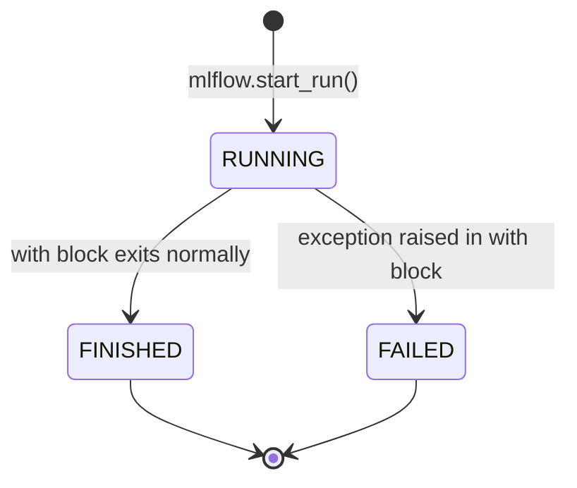

# D — MLflow Internals: Tracking, Artifacts, and Model Serialisation

This document explains how MLflow works internally — the tracking store, artifact store, run lifecycle, model flavours, and the skops serialisation format — and maps each concept to the actual code in this project.

Related documents: [Model Training](07-model-training.md) | [Prediction API](09-prediction-api.md) | [Remote Prediction](10-remote-prediction.md) | [Configuration](05-configuration.md)

---

## 1. MLflow's Four Components

MLflow is composed of four loosely coupled components. This project uses three of them:

| Component | Used? | Purpose |
|-----------|-------|---------|
| **Tracking** | Yes | Log parameters, metrics, and artifacts for each training run |
| **Models** | Yes | Standardised model packaging and loading |
| **Model Registry** | No | Versioning and staging of production models |
| **Projects** | No | Packaging ML code for reproducible execution |

---

## 2. The Tracking Store

The **tracking store** is where MLflow persists run metadata: parameters, metrics, tags, and run status. It is a database, not a file system.

### Two Backends Used in This Project

**Local SQLite (default):**

```python
tracking_uri = f"sqlite:///{PROJECT_ROOT / 'mlflow.db'}"
mlflow.set_tracking_uri(tracking_uri)
```

MLflow creates a SQLite database file at `customer-churn/mlflow.db`. The schema includes tables for experiments, runs, parameters, metrics, and tags. This is the backend used inside the Docker image (baked in during `docker build`).

**Databricks (remote):**

```python
mlflow.set_tracking_uri("databricks")
```

When the URI is `"databricks"`, MLflow delegates all tracking API calls to the Databricks REST API, authenticated via the `DATABRICKS_HOST` and `DATABRICKS_TOKEN` environment variables read by the Databricks SDK.

### What Gets Stored in the Tracking Store

For each run, the tracking store records:

| Data | Example | MLflow API |
|------|---------|-----------|
| Run ID | `a1b2c3d4e5f6...` | Auto-generated UUID |
| Experiment ID | `1` | From `set_experiment()` |
| Status | `FINISHED`, `FAILED`, `RUNNING` | Set by context manager |
| Start/end time | Unix timestamps | Auto-recorded |
| Parameters | `{"n_estimators": "200", "max_depth": "8"}` | `mlflow.log_params()` |
| Metrics | `{"accuracy": 0.87, "precision": 0.69}` | `mlflow.log_metrics()` |
| Artifact location | `mlruns/1/a1b2c3.../artifacts/` | Auto-recorded |

Note: MLflow stores all parameter values as **strings**, even if you pass integers. This is why `config["model"]["n_estimators"]` (an integer) is stored as `"200"`.

---

## 3. The Artifact Store

The **artifact store** is a separate storage location for large files — model binaries, plots, datasets. It is a file system path or object storage URI.

### Local Artifact Store

When using SQLite tracking, artifacts are stored in `mlruns/` alongside the database:

```
customer-churn/
└── mlruns/
    └── <experiment_id>/
        └── <run_id>/
            └── artifacts/
                └── random_forest/
                    ├── MLmodel          ← Model metadata
                    ├── model.pkl        ← Serialised model (skops format)
                    ├── conda.yaml       ← Conda environment spec
                    ├── python_env.yaml  ← Python environment spec
                    └── requirements.txt ← pip requirements
```

### The `MLmodel` File

Every MLflow model artifact contains an `MLmodel` file that describes the model's **flavours** — the different ways it can be loaded:

```yaml
artifact_path: random_forest
flavors:
  python_function:
    env:
      conda: conda.yaml
      virtualenv: python_env.yaml
    loader_module: mlflow.sklearn
    model_path: model.pkl
    predict_fn: predict
    python_version: 3.11.x
  sklearn:
    code: null
    pickled_model: model.pkl
    serialization_format: cloudpickle
    sklearn_version: 1.x.x
run_id: <run_id>
utc_time_created: '...'
```

This file is what allows both `mlflow.sklearn.load_model()` and `mlflow.pyfunc.load_model()` to load the same artifact — they read different flavour sections.

---

## 4. Model Flavours: `sklearn` vs. `pyfunc`

### `mlflow.sklearn` Flavour

Used in `train.py` (logging) and `api.py` (loading):

```python
# Logging (train.py)
mlflow.sklearn.log_model(model, name="random_forest", ...)

# Loading (api.py)
model = mlflow.sklearn.load_model(f"runs:/{run_id}/random_forest")
```

Loading with `mlflow.sklearn` returns the **native scikit-learn object** — a `RandomForestClassifier` instance with all its methods: `predict()`, `predict_proba()`, `feature_importances_`, `classes_`, etc.

This is required by `api.py` because it calls `model.predict_proba()` and `model.classes_`, which are scikit-learn-specific.

### `mlflow.pyfunc` Flavour

Used in `predict_remote.py`:

```python
model = mlflow.pyfunc.load_model(model_uri)
prediction = model.predict(customer_dataframe)
```

Loading with `mlflow.pyfunc` returns an `mlflow.pyfunc.PyFuncModel` wrapper. This wrapper:
- Exposes only a single `.predict(dataframe)` method.
- Works for any MLflow-logged model regardless of framework (sklearn, PyTorch, TensorFlow, etc.).
- Does not expose framework-specific methods like `predict_proba()`.

`predict_remote.py` uses `pyfunc` because it only needs a binary prediction (0 or 1), not a probability.

---

## 5. Model Serialisation: skops

When `mlflow.sklearn.log_model()` is called, it serialises the `RandomForestClassifier` to disk. The serialisation format is **skops** (scikit-learn object persistence system).

### Why Not pickle?

Python's standard `pickle` module is the traditional way to serialise Python objects. However, pickle has a critical security vulnerability: **arbitrary code execution**. A malicious pickle file can execute any Python code when loaded. This is a serious risk when loading models from untrusted sources.

### What skops Does

skops is a safer alternative that:
1. Serialises the model to a `.pkl` file using a restricted subset of pickle.
2. Records the **types** of all objects in the serialised file.
3. On loading, checks that all types are in an **allowlist** before deserialising.

If an unexpected type is encountered, skops raises an error rather than executing potentially malicious code.

### The `skops_trusted_types` Parameter

```python
mlflow.sklearn.log_model(
    model,
    name=MODEL_ARTIFACT_NAME,
    skops_trusted_types=["sklearn.tree._tree.Tree"],
)
```

`sklearn.tree._tree.Tree` is a Cython extension type (compiled C code) used internally by scikit-learn's decision tree implementation. It is not a pure Python class, so skops does not automatically trust it.

By passing `skops_trusted_types=["sklearn.tree._tree.Tree"]`, the code explicitly says: "I trust this type — allow it to be deserialised." Without this, loading the model would raise a `UntrustedTypesFoundException`.

---

## 6. The Run Lifecycle



In `train.py`:

```python
with mlflow.start_run() as run:
    mlflow.log_params(...)
    model.fit(...)
    mlflow.log_metrics(...)
    mlflow.sklearn.log_model(...)
    # ← run.status = FINISHED here
```

The `api.py` and `predict_remote.py` filter for `FINISHED` runs:

```python
filter_string="attributes.status = 'FINISHED'"
```

This ensures that a run that failed mid-training (e.g., due to a data error) is never loaded as the serving model.

---

## 7. Experiment and Run Discovery

Both `api.py` and `predict_remote.py` use the same two-step pattern to find the latest model:

### Step 1: Find the Experiment

```python
experiment = mlflow.get_experiment_by_name(EXPERIMENT_NAME)
```

An **experiment** is a named container for runs. `get_experiment_by_name` queries the tracking store for an experiment with the given name and returns an `Experiment` object containing the `experiment_id`.

### Step 2: Search for the Latest Run

```python
runs = mlflow.search_runs(
    experiment_ids=[experiment.experiment_id],
    filter_string="attributes.status = 'FINISHED'",
    order_by=["attributes.start_time DESC"],
    max_results=1,
)
run_id = runs.iloc[0]["run_id"]
```

`mlflow.search_runs` executes a query against the tracking store and returns a pandas DataFrame. Each row is one run, with columns for all logged parameters, metrics, and attributes.

- `filter_string` uses MLflow's SQL-like filter syntax.
- `order_by=["attributes.start_time DESC"]` sorts newest first.
- `max_results=1` returns only the top result.
- `runs.iloc[0]["run_id"]` extracts the run ID from the first (and only) row.

### Step 3: Construct the Model URI

```python
model_uri = f"runs:/{run_id}/{MODEL_ARTIFACT_NAME}"
```

The `runs:/` scheme is an MLflow URI format that tells the loader: "find the artifact named `random_forest` inside the run with this ID." MLflow resolves this to the actual file path in the artifact store.

---

## 8. Local vs. Databricks: What Changes

| Aspect | Local SQLite | Databricks |
|--------|-------------|------------|
| `MLFLOW_TRACKING_URI` | `sqlite:///mlflow.db` | `databricks` |
| Tracking store location | `customer-churn/mlflow.db` | Databricks workspace database |
| Artifact store location | `customer-churn/mlruns/` | Databricks DBFS or cloud storage |
| Authentication | None | `DATABRICKS_HOST` + `DATABRICKS_TOKEN` |
| `DATABRICKS_EXPERIMENT_PATH` | `customer-churn` (simple name) | `/Users/<email>/customer-churn` (full path) |
| MLflow UI | `mlflow ui` command | Databricks workspace UI |

The code handles both transparently — the only difference is the `MLFLOW_TRACKING_URI` value.

---

Previous: [Synthetic Data Math ←](C-synthetic-data-math.md) | Back to [Index →](index.md)
